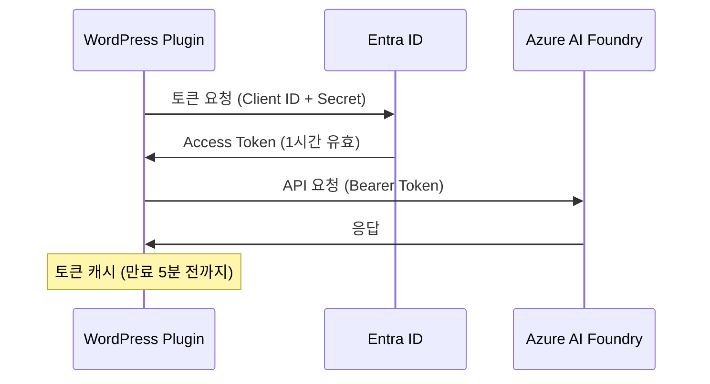

# Entra ID (Service Principal) 인증 설정 가이드

## 📋 개요

Azure AI Foundry Project API를 사용하려면 **Entra ID (구 Azure AD) 인증**이 필요합니다.  
이 문서는 Service Principal을 사용한 인증 설정 방법을 안내합니다.

---

## 🔑 Service Principal 정보

이미 생성된 Service Principal 정보입니다:

| 항목 | 값 |
|------|-----|
| **App ID (Client ID)** | `712140a9-b518-4380-bfac-7a717ceffbd4` |
| **Client Secret** | ⚠️ 보안상 별도 전달 (GitHub에 기록 불가) |
| **Tenant ID** | `f04fa9b8-2e34-4569-8ea3-3959d1de33db` |
| **Display Name** | `azure-ai-chatbot-wordpress` |
| **권한** | Cognitive Services User |
| **범위** | `/subscriptions/3d56f885-63f4-4e57-86bb-fe73c761b46e/resourceGroups/rg-eduelden04-2296/providers/Microsoft.CognitiveServices/accounts/eduelden04-2296-resource` |

---

## ⚙️ WordPress 설정

### 1. 인증 방식 선택
- **API Key 인증**: 간단하지만 계정 수준 접근
- **Entra ID 인증** ✅: 프로젝트 수준 세밀한 권한 제어, AI Foundry Project API 필수

### 2. 설정 입력

WordPress 관리자 → Azure AI Chatbot → 설정 페이지:

```
인증 방식: Entra ID (Service Principal)

Client ID: 712140a9-b518-4380-bfac-7a717ceffbd4
Client Secret: [별도 제공된 Secret 값 입력]
Tenant ID: f04fa9b8-2e34-4569-8ea3-3959d1de33db

Endpoint: https://eduelden04-2296-resource.services.ai.azure.com/api/projects/eduelden04-2296
Agent ID: asst_XXXXXXXXXXXXXXXXXXXXXXXX
```

**중요**: Endpoint에 반드시 `/api/projects/{프로젝트명}` 경로를 포함해야 합니다!

---

## 🔄 작동 방식

### OAuth 2.0 Client Credentials Flow



### 토큰 관리

- **캐싱**: WordPress Transient로 자동 캐시
- **갱신**: 만료 5분 전 자동 갱신
- **보안**: Client Secret 암호화 저장

---

## 🛠️ Service Principal 생성 방법 (참고)

새로운 프로젝트를 위해 Service Principal을 생성하려면:

```bash
az ad sp create-for-rbac \
  --name "azure-ai-chatbot-wordpress-prod" \
  --role "Cognitive Services User" \
  --scopes "/subscriptions/{SUBSCRIPTION_ID}/resourceGroups/{RESOURCE_GROUP}/providers/Microsoft.CognitiveServices/accounts/{ACCOUNT_NAME}"
```

**출력 예시**:
```json
{
  "appId": "xxxxxxxx-xxxx-xxxx-xxxx-xxxxxxxxxxxx",
  "displayName": "azure-ai-chatbot-wordpress-prod",
  "password": "xxxxxxxxxxxxxxxxxxxxxxxxxxxxxxxx",
  "tenant": "xxxxxxxx-xxxx-xxxx-xxxx-xxxxxxxxxxxx"
}
```

- `appId` → Client ID
- `password` → Client Secret
- `tenant` → Tenant ID

---

## ✅ 연결 테스트

설정 완료 후:

1. WordPress 관리자 → Azure AI Chatbot → 설정
2. **연결 테스트** 버튼 클릭
3. 성공 메시지 확인:
   ```
   ✓ Azure AI 연결에 성공했습니다! 에이전트가 정상적으로 응답했습니다.
   ```

### 오류 해결

#### HTTP 401 - 인증 실패
```
• Client ID, Client Secret, Tenant ID가 올바른지 확인
• Service Principal에 Cognitive Services User 권한이 있는지 확인
```

#### HTTP 403 - 권한 없음
```
• Service Principal에 해당 리소스 접근 권한 확인
• Azure Portal에서 역할 할당 재확인
```

#### HTTP 404 - 리소스 없음
```
• Endpoint URL에 /api/projects/{프로젝트명} 경로 포함 확인
• Agent ID (asst_로 시작) 확인
```

---

## 📚 참고 자료

- [Azure AI Foundry 문서](https://learn.microsoft.com/azure/ai-services/agents/)
- [Entra ID Service Principal](https://learn.microsoft.com/entra/identity-platform/app-objects-and-service-principals)
- [OAuth 2.0 Client Credentials](https://learn.microsoft.com/entra/identity-platform/v2-oauth2-client-creds-grant-flow)

---

## 🔐 보안 주의사항

⚠️ **Client Secret은 민감한 정보입니다!**

- WordPress 데이터베이스에 암호화되어 저장됩니다
- Git에 커밋하지 마세요
- 정기적으로 갱신하세요
- 유출 시 즉시 Azure Portal에서 재생성하세요

---

**작성일**: 2025-10-04  
**버전**: 2.0.0  
**작성자**: 허석 (Heo Seok)
