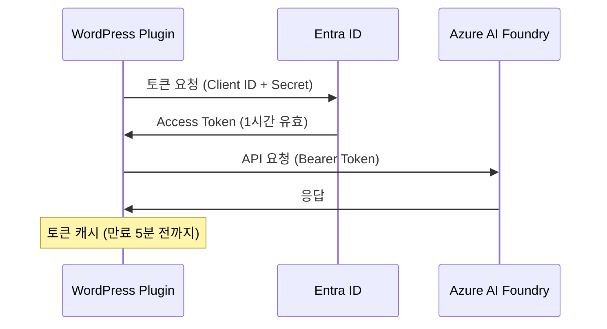

# Entra ID (Service Principal) 인증 설정 가이드

## 📋 개요

Azure AI Foundry Project API를 사용하려면 **Entra ID (구 Azure AD) 인증**이 필요합니다.  
이 문서는 Service Principal을 사용한 인증 설정 방법을 안내합니다.

---

## 🔑 Service Principal 정보 예시

생성된 Service Principal 정보는 다음과 같은 형식입니다:

| 항목 | 예시 값 | 설명 |
|------|---------|------|
| **App ID (Client ID)** | `xxxxxxxx-xxxx-xxxx-xxxx-xxxxxxxxxxxx` | 애플리케이션 고유 ID |
| **Client Secret** | `xxxxxxxxxxxxxxxxxxxxxxxxxxxxxxxx` | 보안 비밀 키 (안전하게 보관!) |
| **Tenant ID** | `xxxxxxxx-xxxx-xxxx-xxxx-xxxxxxxxxxxx` | Azure AD 테넌트 ID |
| **Display Name** | `azure-ai-chatbot-wordpress` | Service Principal 표시 이름 |
| **권한** | Cognitive Services User | 필요한 역할 권한 |
| **범위** | `/subscriptions/{subscription-id}/resourceGroups/{rg-name}/providers/Microsoft.CognitiveServices/accounts/{account-name}` | 리소스 범위 |

---

## ⚙️ WordPress 설정

### 1. 인증 방식 선택
- **API Key 인증**: 간단하지만 계정 수준 접근
- **Entra ID 인증** ✅: 프로젝트 수준 세밀한 권한 제어, AI Foundry Project API 필수

### 2. 설정 입력

WordPress 관리자 → Azure AI Chatbot → 설정 페이지:

```
인증 방식: Entra ID (Service Principal)

Client ID: xxxxxxxx-xxxx-xxxx-xxxx-xxxxxxxxxxxx
Client Secret: [생성된 Secret 값 입력]
Tenant ID: xxxxxxxx-xxxx-xxxx-xxxx-xxxxxxxxxxxx

Endpoint: https://{your-resource-name}.services.ai.azure.com/api/projects/{your-project-name}
Agent ID: asst_XXXXXXXXXXXXXXXXXXXXXXXX
```

**중요**: 
- Endpoint에 반드시 `/api/projects/{프로젝트명}` 경로를 포함해야 합니다!
- `{your-resource-name}`: Azure AI 리소스 이름으로 교체
- `{your-project-name}`: AI Foundry 프로젝트 이름으로 교체

---

## 🔄 작동 방식

### OAuth 2.0 Client Credentials Flow



### 토큰 관리

- **캐싱**: WordPress Transient로 자동 캐시
- **갱신**: 만료 5분 전 자동 갱신
- **보안**: Client Secret 암호화 저장

---

## 🛠️ Service Principal 생성 방법

### Azure CLI를 사용한 생성

```bash
az ad sp create-for-rbac \
  --name "azure-ai-chatbot-wordpress" \
  --role "Cognitive Services User" \
  --scopes "/subscriptions/{SUBSCRIPTION_ID}/resourceGroups/{RESOURCE_GROUP}/providers/Microsoft.CognitiveServices/accounts/{ACCOUNT_NAME}"
```

**필수 값 설정**:
- `{SUBSCRIPTION_ID}`: Azure 구독 ID
- `{RESOURCE_GROUP}`: 리소스 그룹 이름
- `{ACCOUNT_NAME}`: Azure AI 계정 이름

**출력 예시**:
```json
{
  "appId": "xxxxxxxx-xxxx-xxxx-xxxx-xxxxxxxxxxxx",
  "displayName": "azure-ai-chatbot-wordpress",
  "password": "xxxxxxxxxxxxxxxxxxxxxxxxxxxxxxxx",
  "tenant": "xxxxxxxx-xxxx-xxxx-xxxx-xxxxxxxxxxxx"
}
```

**값 매핑**:
- `appId` → **Client ID** (WordPress 설정에 입력)
- `password` → **Client Secret** (WordPress 설정에 입력, 안전하게 보관!)
- `tenant` → **Tenant ID** (WordPress 설정에 입력)

### Azure Portal을 사용한 생성

1. **Azure Portal** → **Entra ID** → **App registrations** → **New registration**
2. 이름 입력: `azure-ai-chatbot-wordpress`
3. **Certificates & secrets** → **New client secret** → 생성
4. **API permissions** → **Add permission** → **Azure Cognitive Services**
5. Azure AI 리소스 → **Access control (IAM)** → **Add role assignment** → **Cognitive Services User**

---

## ✅ 연결 테스트

설정 완료 후:

1. WordPress 관리자 → Azure AI Chatbot → 설정
2. **연결 테스트** 버튼 클릭
3. 성공 메시지 확인:
   ```
   ✓ Azure AI 연결에 성공했습니다! 에이전트가 정상적으로 응답했습니다.
   ```

### 오류 해결

#### HTTP 401 - 인증 실패
```
• Client ID, Client Secret, Tenant ID가 올바른지 확인
• Service Principal에 Cognitive Services User 권한이 있는지 확인
```

#### HTTP 403 - 권한 없음
```
• Service Principal에 해당 리소스 접근 권한 확인
• Azure Portal에서 역할 할당 재확인
```

#### HTTP 404 - 리소스 없음
```
• Endpoint URL에 /api/projects/{프로젝트명} 경로 포함 확인
• Agent ID (asst_로 시작) 확인
```

---

## 📚 참고 자료

- [Azure AI Foundry 문서](https://learn.microsoft.com/azure/ai-services/agents/)
- [Entra ID Service Principal](https://learn.microsoft.com/entra/identity-platform/app-objects-and-service-principals)
- [OAuth 2.0 Client Credentials](https://learn.microsoft.com/entra/identity-platform/v2-oauth2-client-creds-grant-flow)

---

## 🔐 보안 주의사항

⚠️ **Client Secret은 민감한 정보입니다!**

- WordPress 데이터베이스에 암호화되어 저장됩니다
- Git에 커밋하지 마세요
- 정기적으로 갱신하세요
- 유출 시 즉시 Azure Portal에서 재생성하세요

---

## 💡 자주 묻는 질문

### Q: API Key 인증과 Entra ID 인증의 차이는?
**A**: 
- **API Key**: 간단하지만 계정 전체 접근 권한
- **Entra ID**: 프로젝트 단위로 세밀한 권한 제어, AI Foundry Project API 필수

### Q: Client Secret을 잃어버렸어요!
**A**: Azure Portal에서 새 Secret을 생성하고 WordPress 설정을 업데이트하세요. 이전 Secret은 자동으로 무효화됩니다.

### Q: Service Principal 권한 범위는 어떻게 설정하나요?
**A**: Azure CLI에서 `--scopes` 옵션으로 특정 리소스만 접근하도록 제한할 수 있습니다.

---

**작성일**: 2025-10-05  
**버전**: 2.2.4  
**라이선스**: GPL-2.0+
